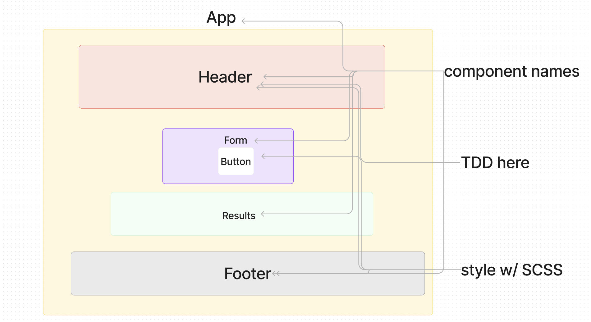
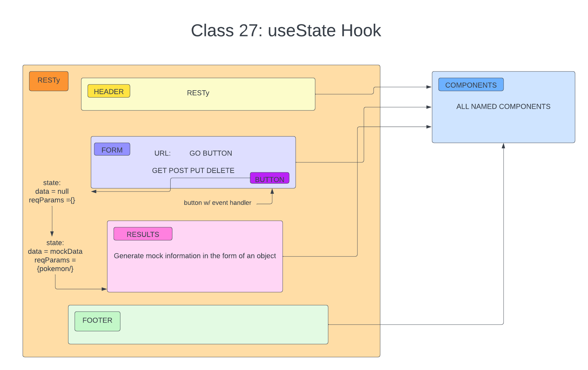
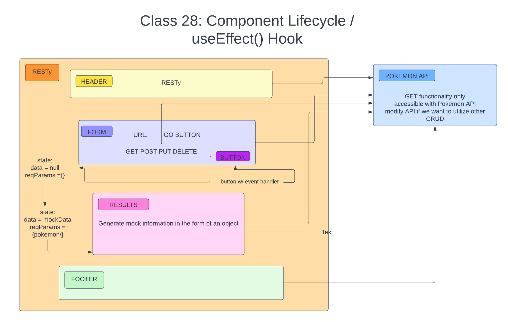

# LAB - Class 26
## Author: Kao Saelor

## Project: Component Based UI

### Problem Domain  

Today, we begin the first of a 4-Phase build of the RESTy application, written in React. In this first phase, our goal is to setup the basic scaffolding of the application, with intent being to add more functionality to the system as we go. This initial build sets up the file structure so that we can progressively build this application in a scalable manner.

### Links and Resources

- [GitHub Actions ci/cd]()
- [front-end application]()

### Collaborators

### Setup

#### `.env` requirements (where applicable)

for now I have none and do not require one

#### How to initialize/run your application (where applicable)

- e.g. `npm start`

#### How to use your library (where applicable)

#### Features / Routes

- Feature One: Details of feature
- GET : `/hello` - specific route to hit

#### Tests

- npm test

#### UML

# LAB - Class 27

## Project: useState hooks

### Problem Domain  

In phase 2, we will be receiving user input in preparation of connecting to live APIs, using the useState() hook in our functional components. In order to properly manage state with the useState hook, we will now convert `<App />` to a functional component.

The following user stories detail the major functionality for this phase of the project.

- As a user, I want to enter the REST Method and URL to an API.
- As a user, I want to see a summary of my request as well as results returned from an API request in my browser in a readable format.

Application Flow:

- User enters an API URL.
- Chooses a REST Method.
- Clicks the “Go” button.
- Application fetches data from the URL given, with the method specified.
- Displays the response headers and results separately.
- Both headers and results should be “pretty printed” JSON.

### Links and Resources

- [GitHub Actions ci/cd]()
- [front-end application]()

### Collaborators

### Setup

#### `.env` requirements (where applicable)

for now I have none and do not require one

#### How to initialize/run your application (where applicable)

- e.g. `npm start`

#### How to use your library (where applicable)

#### Features / Routes

- Feature One: Details of feature
- GET : `/hello` - specific route to hit

#### Tests

- npm test

#### UML

# LAB - Class 28

## Project: Component Lifecycle / useEffect() Hook

### Problem Domain  

In phase 3, we will be connecting RESTy to live APIs, fetching and displaying remote data. Our primary focus will be to service GET requests.

The following user stories detail the major functionality for this phase of the project.

- As a user, I want to enter the URL to an API and issue a GET request so that I can retrieve it’s data.
- As a user, I want to see the results returned from an API request in my browser in a readable format.

Application Flow:

- User enters an API URL.
- Chooses a REST Method.
- Clicks the “Go” button.
- Application fetches data from the URL given, with the method specified.
- Displays the response headers and results separately.
- Both headers and results should be “pretty printed” JSON.

### Links and Resources

- [GitHub Actions ci/cd]()
- [front-end application]()

### Collaborators

### Setup

#### `.env` requirements (where applicable)

None

#### How to initialize/run your application (where applicable)

- e.g. `npm start`

#### How to use your library (where applicable)

#### Features / Routes

- Feature One: Details of feature
- GET : `/hello` - specific route to hit

#### Tests

- npm test

#### UML

# LAB - Class 29

## Project: Advanced State with Reducers

### Problem Domain  

In phase 4, we will be tracking every API call and storing it in history.

The following user stories detail the major functionality for this phase of the project.

- As a user, I want to see a list of my previous API calls, so that I can see the results again, quickly.

Application Flow:

- User enters an API URL.

- Chooses a REST Method.

- Clicks the “Go” button.

- Application fetches data from the URL given, with the method specified.

- Application stores the API request and returned data into state.
  - Updates the list of previous API calls.

- Application Displays the response headers and results separately.
  - Both headers and results should be “pretty printed” JSON.

### Links and Resources

- [GitHub Actions ci/cd]()
- [front-end application]()

### Collaborators

### Setup

#### `.env` requirements (where applicable)

None

#### How to initialize/run your application (where applicable)

- e.g. `npm start`

#### How to use your library (where applicable)

#### Features / Routes

- Feature One: Details of feature
- GET : `/hello` - specific route to hit

#### Tests

- npm test

#### UML

